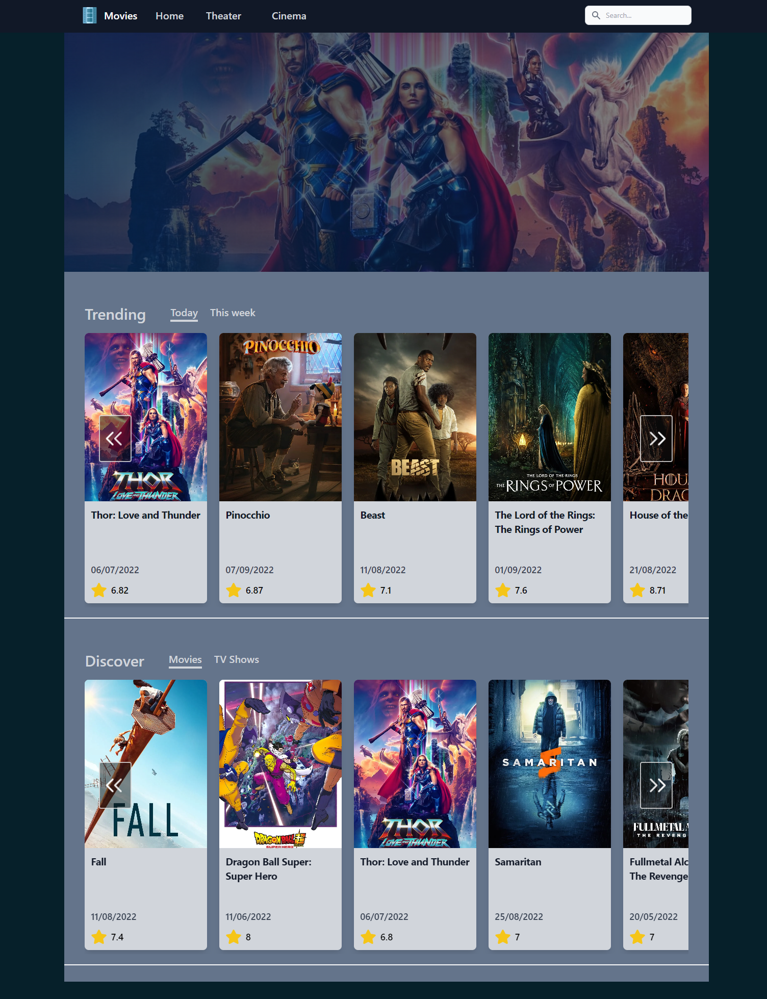

# Movie rating page
> This project is similar to IMDB page. 
> Live demo [_here_](https://movie-rating-timdb.vercel.app/).

## Table of Contents
* [General Info](#general-information)
* [Technologies Used](#technologies-used)
* [Features](#features)
* [Screenshots](#screenshots)
* [Setup](#setup)
* [Project Status](#project-status)
* [Room for Improvement](#room-for-improvement)
* [Acknowledgements](#acknowledgements)
* [Contact](#contact)
<!-- * [License](#license) -->


## General Information
- The page is movie and tv shows library. You can find The newest movies and tv shows and information of each of them.
- You can follow actual trends in media.
- The API for the projects is provided from [TIMDB page](https://developers.themoviedb.org/).
- THe layout is inspired from [timdb page](https://www.themoviedb.org/) and from [imdb page](https://www.imdb.com/)


## Technologies Used
<a href="https://nextjs.org/" target="_blank" rel="noreferrer">  </a> <a href="https://reactjs.org/" target="_blank" rel="noreferrer">  </a> <a href="https://www.typescriptlang.org/" target="_blank" rel="noreferrer">  </a> <a href="https://tailwindcss.com/" target="_blank" rel="noreferrer">  </a> <a href="https://sass-lang.com" target="_blank" rel="noreferrer">  </a> 


## Features
- You can check each entertaiment by clicking on each item. You will find detailed information about the media, cast, videos, images related to it, and also recommendation to it.


## Screenshots

<!-- If you have screenshots you'd like to share, include them here. -->


## Setup
Download the repo by using in your terminal ```git clone https://github.com/Murad-Git/movie-rating-timdb```
then go to the main folder and start the project by
```
cd movie-rating-timbd
npm i
# or 
yarn install

npm run dev
# or
yarn dev
```

## Project Status
Project is: In progress


## Room for Improvement
The original timbd page is more complex. There is a lot of places for improvement.

Room for improvement:
- Search functionality
- Detailed page for each individual sections 
- Images zoom on click

To do:
- Search functionality with advises on fly
- Individual pages for casts, keywords, collections
- Implement zooming images as modal and changing background color


## Acknowledgements

- This project was inspired by [Sonny Sangha YT channel](https://www.youtube.com/watch?v=MqDlsjc8GLo)


## Contact
Created by [Murad Kos](https://welcomeportfolio.netlify.app/) - feel free to contact me!
